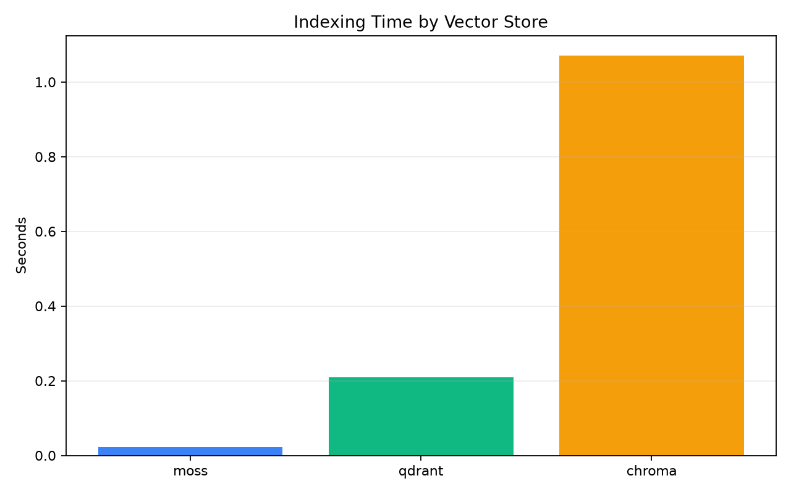
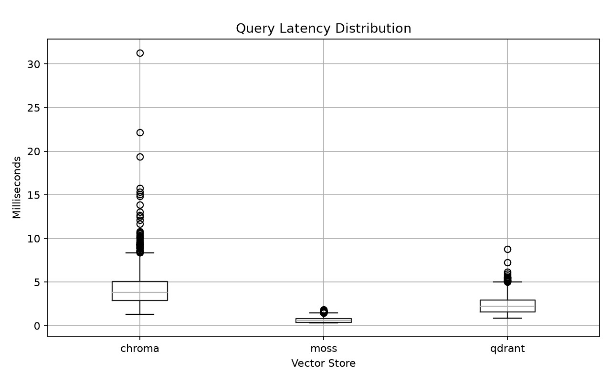
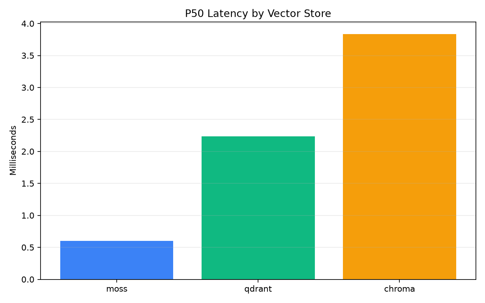

# Moss vs Qdrant vs Chroma Benchmark

This repository benchmarks Moss, Qdrant, and Chroma on semantic search over Jane Austen's *Pride and Prejudice*.

The benchmark is designed to compare vector store behavior, not embedding latency. Text chunks and benchmark questions are embedded once with `BAAI/bge-small-en-v1.5`; every backend receives the same vectors, metadata, query vectors, `top_k`, warmup rounds, and measured query rounds.

---

## Metrics

- **Indexing Time**: wall-clock seconds to insert all chunk vectors after resetting the backend.
- **P50 Latency**: median measured query latency in milliseconds.
- **P99 Latency**: 99th percentile query latency in milliseconds.

---

## Benchmark Results

### Indexing Time

Moss shows significantly faster indexing compared to Qdrant and Chroma.

| Store   | Indexing Time (s) |
|----------|------------------|
| Moss     | ~0.02 |
| Qdrant   | ~0.21 |
| Chroma   | ~1.07 |



---

### Query Latency Distribution

Moss consistently delivers the lowest and most stable query latency distribution.



---

### P50 Query Latency

| Store   | P50 Latency (ms) |
|----------|------------------|
| Moss     | ~0.60 |
| Qdrant   | ~2.23 |
| Chroma   | ~3.83 |



---

### Key Findings

- Moss achieved the fastest indexing performance.
- Moss delivered the lowest median query latency (P50).
- Qdrant performed better than Chroma across all metrics.
- Chroma had the highest indexing and query latency overhead.
- Overall, Moss performed best on this benchmark workload.

---

## Dataset

- Source: Project Gutenberg *Pride and Prejudice*
- URL: https://www.gutenberg.org/cache/epub/1342/pg1342.txt
- Chunk size: 1800 characters
- Overlap: 250 characters

---

## Embedding Model

- Model: `BAAI/bge-small-en-v1.5`
- Library: `sentence-transformers`
- Embeddings are normalized before storage.

---

## Benchmark Questions

50 fixed questions stored in:

```
data/questions/benchmark_questions.json
```

Covering:
- Characters
- Plot
- Relationships
- Themes
- Settings

---

## Methodology

Each store:

1. Reset collection
2. Insert identical embeddings
3. Run warmup queries
4. Run measured queries
5. Record latency distribution
6. Compute P50 and P99

---

## Results Interpretation

This benchmark measures:

- Vector indexing efficiency
- Retrieval latency
- Consistency under repeated queries

It does **not** measure embedding model speed or large-scale ANN behavior.

---

## Reproducibility

- Same embedding model used for all stores
- Precomputed embeddings reused
- Identical dataset and questions
- Backend reset before each run

---

## Limitations

This is a small-scale benchmark on a single dataset and is intended for relative comparison only. Real-world performance may differ based on hardware, dataset size, and backend configuration.
